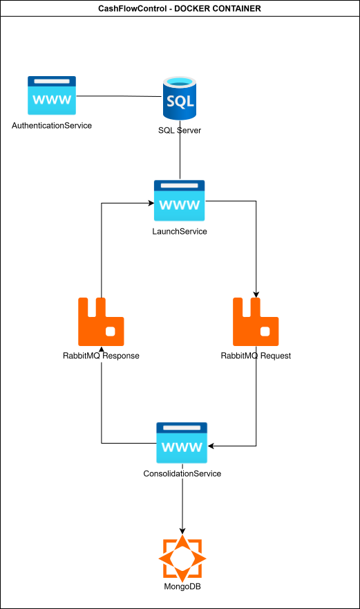
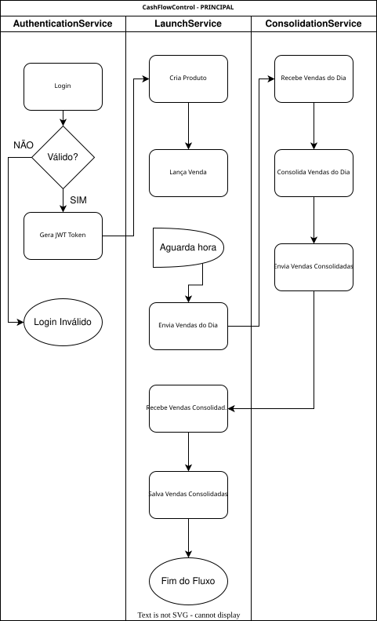

# 🏦 Controle de Fluxo de Caixa

**Controle de Fluxo de Caixa** é um sistema de rastreamento financeiro que ajuda os comerciantes a gerenciar o fluxo de caixa diário com o registro de transações (débito e crédito) e um relatório consolidado diário de saldo.

## 🚀 Funcionalidade
- **Gestão de Transações**: Criar, listar e recuperar transações financeiras.
- **Serviço de Consolidação Diária**: Processa e consolida registros financeiros diariamente de forma assíncrona.
- **Arquitetura Resiliente**: Garante que o serviço de transações continue disponível mesmo que o serviço de consolidação falhe.
- **Escalabilidade**: Suporta até 50 requisições por segundo com uma perda máxima de 5% nas requisições.

## 🛠 Stack Tecnológica
- **C# com .NET 8**
- **Entity Framework Core** para persistência de dados
- **SQL Server** para armazenamento de dados relacionais
- **MongoDB** para armazenamento de dados não-relacionais
- **JWT** para tokenização de usuários
- **MediatR** para comunicação interna
- **Quartz** para agendamento de jobs
- **Fluent Validation** para validação de dados
- **RabbitMQ** para broker de mensagens
- **Docker** para containerização
- **Swagger** para documentação da API
- **xUnit** para testes unitários
- **Serilog** para logging estruturado
- **React** para o frontend


## 📖 Configuração e Uso (Dockerizado)

### 1. Pré-requisitos
Antes de executar o projeto, certifique-se de que você tenha o **Docker** instalado em sua máquina. Caso não tenha o Docker, você pode instalá-lo seguindo as instruções oficiais em: [Instalar o Docker](https://docs.docker.com/get-docker/).

### 2. Clonar o Repositório
Clone o repositório para sua máquina local:
```
sh
git clone https://github.com/Brand00wn/CashFlowControl.git
cd cashflow-control
```

### 3. Executar o Projeto com Docker Compose
No diretório do projeto, basta executar o seguinte comando para iniciar o projeto junto com seus serviços dependentes (como banco de dados, RabbitMQ, etc.):
```
docker-compose up --build
```

### 4. Acessar a Aplicação
A aplicação possui três APIs, para acessá-las, basta entrar nas URls relacionadas a cada módulo:
- **Autenticação** (AuthenticationService - http://localhost:5001/swagger/index.html)
- **Lançamento de Vendas** (LaunchService - http://localhost:5002/swagger/index.html)
- **Consolidação** (ConsolidationService - http://localhost:5003/swagger/index.html)
- **FrontEnd** (Cash Flow Control - http://localhost/)

## 📝 Como Utilizar o frontend
O frontend conta com telas de Login; Reset de Senhas; Lançamento de Vendas; Cadastro e Atualização de Produtos; Visualização de Consolidações e Gerenciamento de Usuários. 
Abaixo as credenciais default de dois tipos de usuários diferentes (admin e regular)
- **URL** http://localhost/login
- **Credencial Admin** - user: **adminuser** pass: **CfcAdmin123!**
- **Credencial User** - user: **regularuser** pass: **CfcUser123!**

### **Fluxo de Funcionamento**
1. Login
2. Cadastro de Produtos
3. Lançamento de Vendas
4. Consolidação (Obs.: A consolidação ocorre por agendamento por meio de uma cronExpression que está armazenada no appSettings do LaunchService. Atualmente está para rodar todos os dias às 23:59 hrs)

## 📝 Como Utilizar a API (Caso queira usar outro frontend/postman)

### 1. **Autenticação & Autorização**

A API de **Autenticação e Autorização** são responsáveis por gerenciar o login e permissões de usuários e a geração de tokens JWT. Para utilizá-las:

- **Acesse a documentação** da API de autenticação e autorização no Swagger [aqui](http://localhost:5001/swagger/index.html).
- **EndPoint para Login**:  
  Envie uma requisição `POST` para `/Authentication/login` com as credenciais de usuário (o exemplo abaixo é um login default real do sistema).
  - Exemplo de corpo da requisição:
	```json
	{
	  "username": "adminuser",
	  "password": "CfcAdmin123!"
	}
	```
  - Em resposta, você receberá um token JWT, que deve ser utilizado nas requisições subsequentes como **Autorização**.
  - **Obs.:** Existe um usuário adminuser que possui a autorização geral, e somente ele pode criar novos usuários. Há também um segundo usuário default que possui apenas permissões de lançamento e consolidação:
    ```json
    {
      "username": "regularuser",
      "password": "CfcUser123!"
    }
    ```
---

### 2. **Criação de Produto**

A API de **Criação de Produto** permite adicionar, remover e atualizar produtos ao sistema para serem utilizados em transações futuras.

- **Acesse a documentação** da API de criação de produto no Swagger [aqui](http://localhost:5004/swagger/index.html).
- **Criar Produto**:  
  Para adicionar um novo produto ao sistema, envie uma requisição `POST` para `/api/Product`. 
  - Exemplo de corpo da requisição:
    ```json
    {
	  "name": "Mexerica", --Nome do Produto
	  "price": 0, --Preço unitário
	  "stock": 0 --Quantidade em estoque
	}
    ```
  - A resposta será uma mensagem informando o sucesso da operação.

- **Consultar Produtos**:  
  Para listar todos os produtos cadastrados, envie uma requisição `GET` para `/api/Product`.
  
- **Atualizar Produtos**:  
  Para atualizar produtos cadastrados, envie uma requisição `PUT` para `/api/Product`. 
  - **Será necessário passar o id do produto no campo id do Swagger ou na url da requisição**
  - Exemplo de corpo da requisição:
    ```json
    {
	  "name": "Mexerica", --Nome do Produto
	  "price": 0, --Preço unitário
	  "stock": 0 --Quantidade em estoque
	}
	
	id = 1 --Na URL/Campo id do Swagger
    ```
  - A resposta será uma mensagem informando o sucesso da operação.
  
- **Deletar Produtos**:  
  Para deletar produtos cadastrados, envie uma requisição `DELETE` para `/api/Product`. 
  - **Será necessário passar o id do produto no campo id do Swagger ou na url da requisição**

### 3. **Lançamento de Vendas**

A API de **Lançamento de Vendas** permite criar e consultar transações financeiras (débito e crédito).

- **Acesse a documentação** da API de lançamentos no Swagger [aqui](http://localhost:5002/swagger/index.html).
- **Criar Transação**:  
  Para registrar uma nova transação, envie uma requisição `POST` para `/api/Launch`. 
  - Exemplo de corpo da requisição:
    ```json
    {
	  "launchType": 0/1, --0 Débito; 1 Crédito
	  "productsOrder": [
		{
		  "productId": 1, --Id do Produto
		  "quantity": 5 --Quantidade de produtos da venda
		}
	  ]
	}
    ```
  - A resposta será uma mensagem informando o sucesso da operação.

- **Consultar Transações**:  
  Para consultar todas as transações registradas, envie uma requisição `GET` para `/api/Launch`.
  
---

### 4. **Consolidação Diária**

A API de **Consolidação Diária** é responsável por processar e consolidar os registros financeiros do dia.

- **Acesse a documentação** da API de consolidação no Swagger [aqui](http://localhost:5003/swagger/index.html).
- A consolidação é feita automaticamente, programada para todos os dias às 23:59 hrs, processando os registros de transações do dia.
- **Obter o Relatório Consolidado**:  
  Para consultar o relatório diário consolidado, envie uma requisição `GET` para `/Consolidation`.
  - A resposta incluirá o total de créditos, débitos e o saldo final do dia.

---

## 🔶➡️ Diagramas

- **Desenho Arquitetural do Sistema**



---

- **Fluxo de processos**



---
